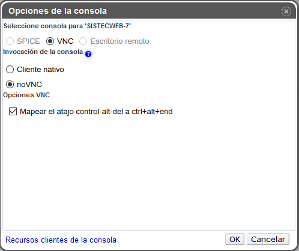
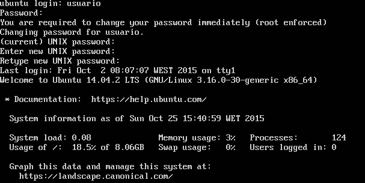
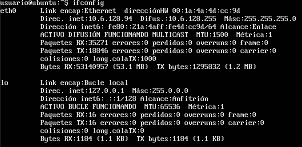

## Práctica: Conversor de Temperaturas con Web Workers

### Descripción de la Práctica

En esta práctica vamos a desplegar nuestro Conversor de Temperatura en el servidor del IAAS de la ULL. También vamos a añadirle a la práctica los tests con Sinon.

### Requisitos de la Práctica:

- Despliegue la práctica anterior Karma, Travis y Web Workers en su máquina virtual del servicio iaas.ull.es.

- Si no ha usado Sinon.JS en la práctica anterior añada pruebas de mocking con Sinon.JS.

- Añada en el README.md un pequeño tutorial de como usar y desplegar una aplicación web en iaas.ull.es.

- La IP dinámica de su máquina virtual no debería cambiar. Publique la URL de despliegue en su máquina además de los enlaces habituales.

---

## Tutorial de uso y despliegue de una aplicación web en iaas.ull.es

Accedemos al portal web de [iaas.ull.es](http://iaas.ull.es), para ello debemos de estar dentro de la ULL y loguearnos dentro de [acceso.ull.es](http://acceso.ull.es), en otro caso, si estamos fuera de esa red, tendremos que acceder mediante el [servicio de VPN de la Universidad](https://usuarios.ull.es/vpn/).

Una vez que hayamos accedido a la web del iaas ya tenemos disponible nuestra máquina (SISTEcWEB). Primero que nada tenemos que configurar el visor VNC para que nos muestra la consola en otra pestaña del navegador, para ello marcamos la opción noVNC de las opciones de consola.

Hecho esto ya podremos acceder a nuestra máquina y comenzar a configurarla para trabajar en ella.
En primer lugar hacemos login con usuario/usuario y seguidamente a este acceso cambiamos la contraseña y ponemos una propia.

Después debemos de realizar un ifconfig para averiguar la IP de nuestra máquina y así poder usar ssh.

Luego tenemos que instalar npm con el comando:

<pre> sudo apt-get install npm </pre>

Y generamos una pareja de clave pública/privada con:

<pre> ssh-keygen -t rsa </pre>

Añadimos la clave generada a github para poder trabar con él y despues de configurar el ssh ya podemos clonar la aplicación en la máquina:

<pre> git clone  git@github.com:alu0100600582/Conversor_iaas.git </pre>

Hacemos un npm install para instalar las dependencias del proyecto y para finalizar debemos ejecutar nodejs para el despliegue de la aplicación. Para ellos usamos el comando:

<pre> nodejs static-server.js </pre>

Una vez realizado todo el proceso deberiamos de tener disponible nuestra aplicación en la Web.

[Conversor de Temperatura en la Web](http://10.6.128.94:8080/index.html)

#### Enlaces

---

Travis

---
Enlace a la Comunidad de la Asignatura: https://plus.google.com/u/1/communities/111920114018766363342?cfem=1

Mi GitHub page: http://alu0100600582.github.io/

Repositorio Github: https://github.com/alu0100600582/Conversor_iaas

Despliegue de la aplicación en el IAAS: http://10.6.128.94:8080/index.html

GitHub page de la aplicación: http://alu0100600582.github.io/Conversor_WebWorkers/

GitHub page de las pruebas: http://alu0100600582.github.io/Conversor_iaas/tests/test_blanket.html
